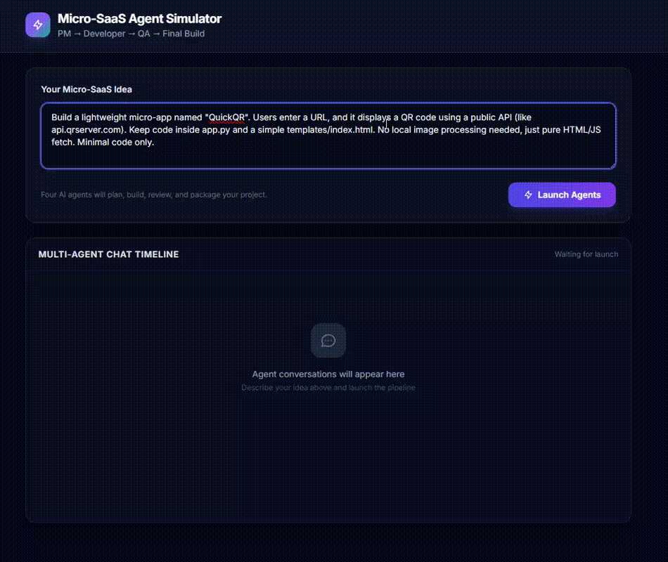

# 🤖 SaaS Agent Simulator

A production-ready, sequential multi-agent AI pipeline built with **Flask** and powered by **Groq (Llama 3.3 70B)**. This application simulates a collaborative software development lifecycle (SDLC) where specialized AI agents collaborate to generate, review, and pack complete Micro-SaaS applications into a downloadable ZIP architecture.

---

## 🎬 Live Project Demo

  

---

## 🚀 Live Demo Link
Check out the live application deployed on Vercel:
🔗 **[Live Demo Link](https://saas-agent-simulator.vercel.app)**

---

## 🏗️ Multi-Agent Architecture & Workflow

The platform utilizes a sequential agent relay system to transform a raw user prompt into structured codebases:

1. **Product Manager Agent (Step 1):** Analyzes the user's core idea, extracts target personas, and defines granular functional requirements.
2. **Lead Developer Agent (Step 2):** Takes the PM requirements, chooses the tech stack, plans the module file structure, and creates clean architectures.
3. **QA Engineer Agent (Step 3):** Critically reviews the developer's plan, flagging edge cases, security vulnerabilities, and logic flaws.
4. **Lead Developer Refinement (Step 4):** Consolidates the QA feedback, strips boilerplate stubs, enforces efficiency rules, and outputs clean, runnable source code wrapped in strict delimiter formatting.

---

## ✨ Features

- **Sequential Multi-Agent Relay:** Simulates cross-functional alignment before code generation.
- **Strict Delimiter Parsing:** A regex-based post-processing engine automatically extracts structured code blocks out of LLM responses.
- **Dynamic File Generation:** Packages real-time code components into a structured directory on the fly.
- **Vercel Serverless Writable Bypass:** Architected to run smoothly within read-only serverless constraints by offloading compilation to the isolated `/tmp` directory.
- **Secure Key Management:** Zero-leak design leveraging system environment variables for production API calls.

---

## 🛠️ Tech Stack & Core Libraries

- **Backend Framework:** Flask (Python)
- **LLM Orchestration:** Groq Cloud SDK (`llama-3.3-70b-versatile`)
- **Frontend UI:** Responsive Tailwind CSS Interface
- **Deployment Platform:** Vercel (Serverless Functions)

